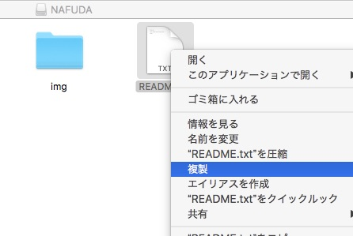
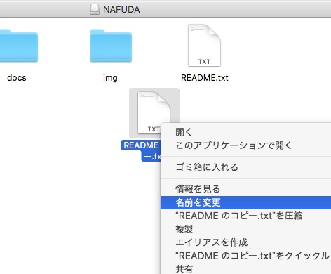
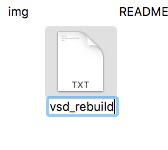
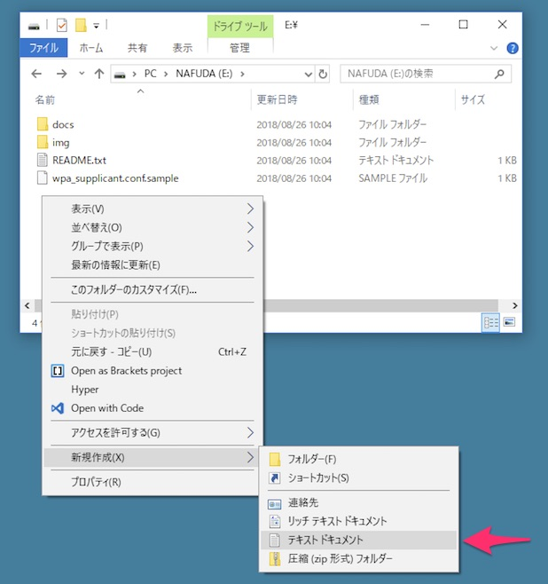
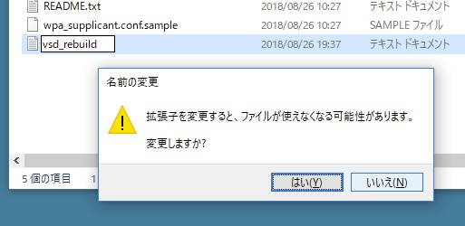

トラブルシュート
==============

## 画面に表示がされない、名札スライドショーが開始されない

- ラズパイのLEDが光っていることを確認してください、光っていない場合は、電源とmicroSDの接続を確認してください。
- 電源（USBバッテリー）が点灯していることを確認してください、点灯していない場合はバッテリー切れの可能性があります。
- e-paperとraspberry piのケーブルがぬけていないか確認してください。抜けている場合は適切に挿しなおしてください。
- E-paperのコネクタが接触不良をおこしていることがあります、E-paper側のコネクタを抜き差ししてみてください（固く、取り外しが難しいので、注意して行ってください）。
- 起動には1~3分程度かかります。
- 起動しているが、表示上わからない場合があります。ログインしてみてください。
- `img`内の画像を変えてみてください（画像読み込みに失敗している可能性があります）。


## NAFUDAドライブをPCで認識しない

- 起動には１〜３分かかります。USBをPCと接続した後、名札が起動するまで待ってください。
- ただしく中央よりのUSBポートに接続していることを確認してください。
- USBケーブルの相性かもしれません、別のUSBケーブルを試してください。


## NAFUDAドライブにエラーがあると表示される（特にWindowsにおいて）

> ※ microSDを直接PCにつないだ場合は、このようなフォーマットをおこなうと起動しなくなります。

- OSの指示に従ってスキャンや復旧を行ってください。（特に、最初の一回は出る可能性が高いです）
- もしスキャンに失敗した場合は、名札を取り外して再度接続してください。NAFUDAドライブが壊れている場合は、起動中に自動的に復旧を試みます。
- もしフォーマットをした場合、「NAFUDAドライブを初期化する」を元にNAFUDAドライブを初期状態にもどすことはできます。


# 初期化

## NAFUDAドライブを初期化する

NAFUDAドライブに`vsd_rebuild`というファイルを作成して、名札を再起動してください。

初期化されると、サンプルファイルなどもあたらしく生成されます。

> ※ 詳細は`/bootup/README.md`の`vsd_rebuild`項目を参照してください。

> ※ これはNAFUDAシステムの完全初期化ではありません。NAFUDAドライブの外にあるファイルや、ID/PASSが初期化されるわけではありません。

NAFUDAドライブをPCで初期化（フォーマット）すると、正しく動作しなくなる可能性があります。


### TIPS: ファイルの作成の仕方がわからない、うまく制作できない場合

シェルからtouchしたり、テキストエディタで新規作成したファイルを保存してもかまいませんが、`vsd_rebuild`のファイルは中身は何でもよいので、適当なファイルをコピーしてリネームしても構いません。

たとえば、Macの場合はNAFUDAドライブをひらき、適当なファイル（ここでは`README.md`）を複製することでも作れます。

> ※ ファイルである必要があります、ディレクトリを複製してはいけません。



複製してできた「〜 のコピー」の名前を変更します





ここでは拡張子が残らないように注意してください。


Windowsの場合は、NAFUDAドライブの中を右クリックして、新規作成＞テキストファイルとして作成し、



名前を変更するとよいでしょう。



ここでは拡張子がつかないように注意してください。


## パスワード、ホスト名、NAFUDAドライブを初期化する

NAFUDAドライブ直下に`startup.sh`を作成し、

```bash
# たとえば、MacでmicroSDをマウントした場合
$ vi /Volumes/NAFUDA/startup.sh
```

以下の内容を記述します。

```bash
bash /home/pi/bcon_nafuda/setup_script/reset_all.sh
shutdown -r now
```

名札を再起動すると、ホスト名、パスワード、NAFUDAドライブがリセットされ、初期のようにスライドショーがはじまるはずです。また、上記のstartup.shも削除されます。

初期化されると、サンプルファイルなどもあたらしく生成されます。

> 初期化と再起動をおこなうので、３分程度はお待ちください。

> このstartup.shはNAFUDAドライブ内にあるので、初期化とともに消えます。


### NAFUDAドライブがマウントできない場合

microSDを電子名札からぬき、PCにmicroSDを接続します。

`boot`という名称のドライブが現れますので、その直下に`startup.sh`を作成し、以下の内容を記述します。

```bash
bash /home/pi/bcon_nafuda/setup_script/reset_all.sh
```

microSDをPCから正しく取り外し、名札に再接続して再起動をすると、ホスト名、パスワード、NAFUDAドライブがリセットされます。

リセットされたことを確認したら、ログインしたり、もう一度PCにmicroSDを接続して操作するなどして`startup.sh`を削除してください。

初期化されると、サンプルファイルなどもあたらしく生成されます。

> 削除をしないと、起動の度にリセットがかかりつづけます。


## microSD全体をイメージから初期化する

`reset_all.sh`を用いた方法では、NAFUDAドライブ以外のファイルをリセットすることはできません。

microSDを配布時の状態に完全にリセットするには、イメージを以下よりDLしてmicroSDに書き込みする必要があります。

イメージURL:TBD

Etcherやddなどで書き込みをしてください。

[Etcher はこちらからDLできます](https://etcher.io/)。

> ※ 当日であれば、製作者（uzulla）に声をかけてもらえれば、可能な範囲でmicroSDを焼きます。


## イメージからではなく初期化する

> ※ raspbian を自分でインストール・設定できる程度の知識が必要です。

raspbianイメージを焼いて、そこから手順を踏むことでゼロからの再セットアップが可能です。

`setup_script/README.md`を参照して作業してください。

